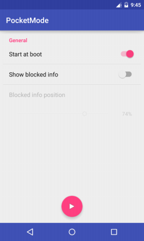

# PocketMode
## Overview

There are four project folders :

 - ***DisableHomeButtonKey*** : Forked from [mugku/Android-LockScreenSample-DisableHomeButtonKey](https://github.com/mugku/Android-LockScreenSample-DisableHomeButtonKey), which implements the function of blocking home key.
 - ***PocketMode_block*** : One way to avoid the error in pocket -- drawing a blocked view, actually **an Activity**, over the lockscreen. In that case, home key can not be interrupted in normal way, because it's key event will be handled by framework directly.
 - ***PocketMode_lock*** : The other way to avoid the false operation -- just lock the screen without any indication, simple and crude. Two defects of that case : this is a full secure lock that requires your PIN/Pattern (if configured) to unlock even if using Smart Lock or a fingerprint scanner; sometimes you wake up the phone and cover the top of the screen unintentionally, then you need to re-wake the phone up. Two of these lead to bad user experience.
 - ***PocketMode*** : The final solution combine ***DisableHomeButtonKey*** (use a window except an Activity as blocked view.) and ***PocketMode_block***, and it is also added some UI custom features. 

## Feature
 - Permission ***"Draw over other apps"*** is added in Android 6.0, its setting view should be shown depending on circumstances.
 - Start at boot.
 - Blocked view's visibility and blocked info's Y coordinate customization.
 - Main service running state indication
 - Press and hold Volume + and Volume - simultaneously to dismiss blocked view.

Android 5.0

Android 6.0

Operation demo

